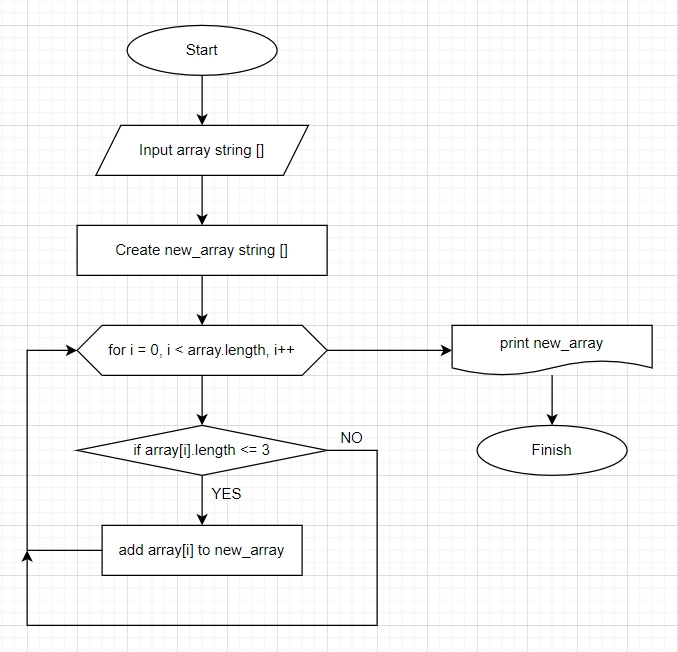

# Csharp_Final_Test
# Final test for course Developer

## Description of test:
Задача алгоритмически не самая сложная, однако для полноценного выполнения проверочной работы необходимо:

1. Создать репозиторий на GitHub
2. Нарисовать блок-схему алгоритма (можно обойтись блок-схемой основной содержательной части, если вы выделяете её в отдельный метод)
3. Снабдить репозиторий оформленным текстовым описанием решения (файл README.md)
4. Написать программу, решающую поставленную задачу
5. Использовать контроль версий в работе над этим небольшим проектом (не должно быть так, что всё залито одним коммитом, как минимум этапы 2, 3, и 4 должны быть расположены в разных коммитах)

Задача: Написать программу, которая из имеющегося массива строк формирует новый массив из строк, длина которых меньше, либо равна 3 символам. Первоначальный массив можно ввести с клавиатуры, либо задать на старте выполнения алгоритма. При решении не рекомендуется пользоваться коллекциями, лучше обойтись исключительно массивами.

Примеры:
[“Hello”, “2”, “world”, “:-)”] → [“2”, “:-)”]
[“1234”, “1567”, “-2”, “computer science”] → [“-2”]
[“Russia”, “Denmark”, “Kazan”] → []

### Описание проекта

1. На первом этапе проекта создаем метод генерации случайного массива строк, где amount_of_strigs это переменная, которая означает число строк в массиве и задается пользователем.
2. На втором этапе проекта создаем метод печати полученного случайного массива.
3. На третьем этапе проекта создаем метод, который из сгенерированного ранее случайного массива строк, формирует новый массив из строк, где длина каждого элемента массива (строки) меньше, либо равна 3 символам.
Блок-схема метода: 
4. На финальном этапе проекта создаем метод печати полученного нового массива.
